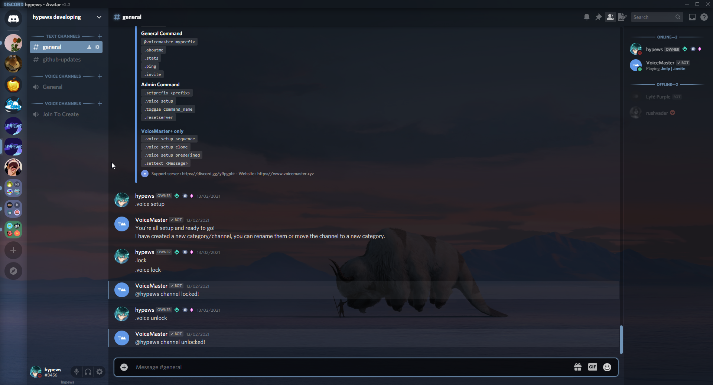
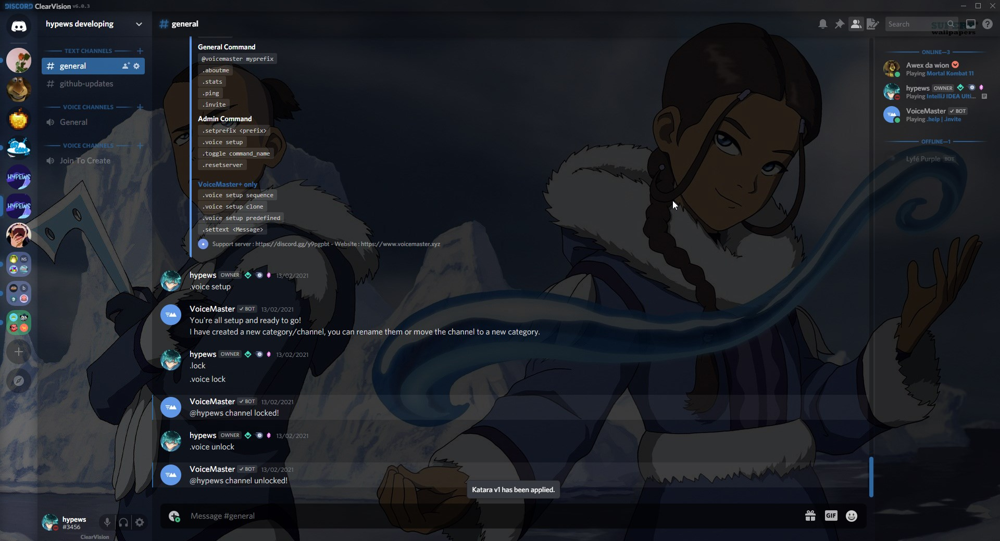
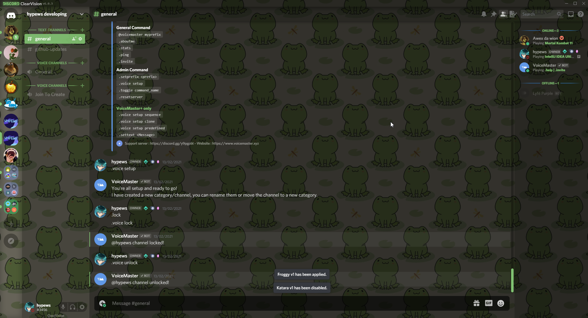

<h1>hypews' ClearVision Themes</h1>

This is a repo for all of the themes I have created using <a href="https://discord.gg/673e2sqBzd">ClearVision</a>

<h2>How to use?</h2>

Find the theme you want (a file with the <code>.theme.css tag</code>) and then place this into your <b>BetterDiscord Themes Folder</b>. You don't need to download the settings files as they just manage the versioning. Please check the repo for any updates on the themes you use. This helps with compatibility with the settings file.

Here are some examples:

<h4>Deku from My Hero Academia</h4>

 
<h4>A CatGirl because someone on Discord wanted it (**cough Bury#0001)</h4>

 
<h4>A Seven Deadly Sins Wallpaper</h4>

 
<h4>Appa from Avatar</h4>

 
<h4>Katara from Avatar</h4>

 
<h4>Frogs</h4>
